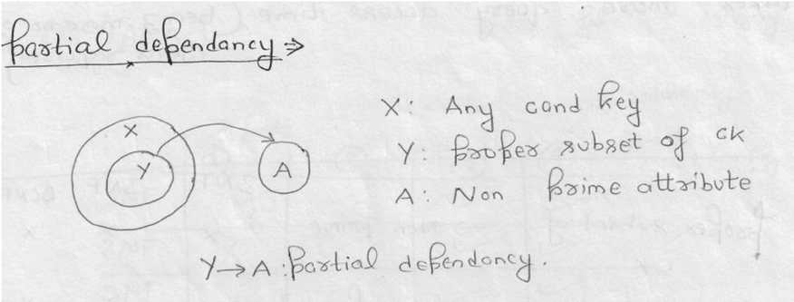
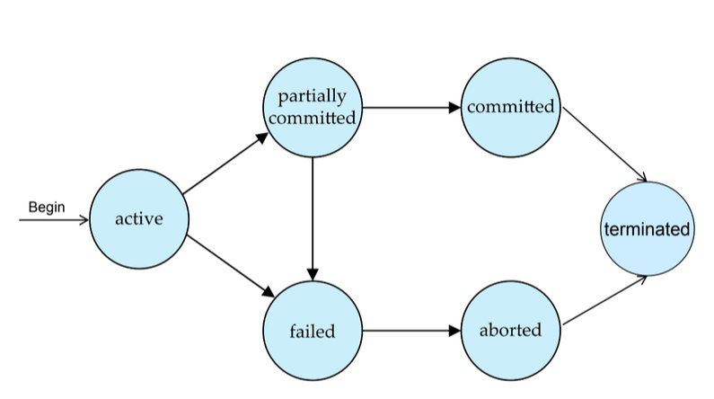

# Database and Information Systems notes

> [!NOTE]
> This is not intended to be comprehensive.

> [!IMPORTANT]
> For SQL refer to [the SQL notes](./sql.md)

<!--
## Intro

1. Levels of abstraction
   * Physical level: Describes how a record (e.g., instructor) is stored
     * Location, name, size of Database in memory, indexing
   * Logical level: Describes data stored in database, and the relationships among the data.
     * It is a logical blueprint of Database

     ```
     type instructor = record
     ID : string;
     name : string;
     dept_name : string;
     salary : integer;
     end;
     ```
   * View level: Application programs hide details of data types. Views can also hide information (such as an employee’s salary) for privacy/security purposes
     * Only a part of the actual database is viewed by the users

2. Schema: Framework to describe the structure of a specific Database System.
   Three schema architecture: 
-->

## ER and relational model

* Strong entity sets have sufficient attributes to form a key.
* Weak entity sets: no key can be formed.

## Normalisation

### First Normal Form

All attributes must be atomic, i.e., no multi-valued attribute.

### Functional Dependency

Require that the value for a certain set of attributes determines uniquely the value for another set of attributes.

x->y
x uniquely determines y. Essentially, if two records have the same entry for x, they have to have the same entry for y.

#### Properties of Functional Dependency

* Reflexive rule: if 'b' is a subset of 'a', then a->b (trivial and valid)
* Augmentation rule: if a->b, then ca->cb (valid)
* Transitivity rule: if a->b, and b->c, then a->c (valid)
* Union rule: If a->b holds and b->c holds, then a->bc holds(valid)
* Decomposition rule: If a->bc holds, then a->b holds and b->c holds (valid)
* Pseudotransitivity rule: If a->b holds and cb->d holds, then ac->d holds (valid)
* Composition rule: If a->b holds and d->c holds, then ad->bc holds (valid)

#### Closure of a Set of Functional Dependencies

The set of all functional dependencies logically implied by F is the
closure of F.
We denote the closure of F by F+

* PA = All the attributes that are present in the set of CK
* NPA = {All the attributes of Relation} - PA

#### Canonical Cover

A canonical cover for F is a set of dependencies Fc such that

* F logically implies all dependencies in Fc, and
* Fc logically implies all dependencies in F, and
* No functional dependency in Fc contains an extraneous attribute
  * An attribute of a functional dependency is said to be extraneous if we can remove it without changing the closure of the set of functional dependencies
* Each left side of functional dependency in Fc is unique. That is, there are no two dependencies in Fc
  * a1->b1 and a2 -> b2 such that
  * a1 = a2

##### To compute a canonical cover for F

repeat
  Use the union rule to replace any dependencies in F of the form

    a1->b1 and a1->b2 with a1 ->b1 b2

  Find a functional dependency a->b in Fc with an extraneous attribute either in a or in b
  If an extraneous attribute is found, delete it from a->b
until (Fc not change)

> [!NOTE]
> Union rule may become applicable after some extraneous attributes have been deleted, so it has to be re-applied

#### Minimal Cover

A minimal cover cannot allow more than one attribute on the right hand side.

##### Method to find Minimal Cover

* First, make RHS of each FD as a single attribute or decompose RHS
  * Use decomposition rule
* Second, pick each functional dependency (FD) and check if other functional decencies (excluding current FD) can generate the same results/dependencies
  * If other FDs can generate, remove the current FD
    * Find the closure of LHS of each FD from other FDs (excluding current FD) and check if other dependencies can generate RHS of current FD. If so, remove current FD
  * This step is called removal of redundant FD.
* Third, pick those FDs that have at least 2 attributes at LHS and try to reduce it (preferably make it one attribute on the LHS). E.g. xy->z
  * Check if closure of one attribute (x) at LHS can derive other attribute (y) of LHS. If so, remove other attribute (y)
    * Similarly we can check if x can be removed
  * This step is called removal of extraneous attribute

### Second Normal Form

Conditions:

* Should be in 1st normal form.
* All NPA should be **fully** functionally dependent on CK.
  * i.e., there should not be any partial dependency.
    * Partial Dependency occurs when a non-prime attribute is functionally dependent on part of a candidate key



### Third Normal Form

Conditions:

* Should be in 2nd normal form.
* No transitive dependency.

### Boyce Codd Normal Form(BCNF)

* Should be in 3rd normal form
* All attributes should be functionally dependent on CK.

### Equivalence of Functional Dependency

Two FDs, F and G are equivalent if

* F covers G; and,
* G covers F

To check G is subset of F(or F covers G)

* For each FD in G, pick it’s LHS and take closure from F
* If all closure from F are able to determine FD in G then F covers G.

## Transaction and Concurrency Control

A transaction is a unit of program execution that accesses and possibly updates various data items.
OR
Set of operations used to perform a logical unit of work.

**Atomicity**: Either all operations or no operations.(No partial execution)
**Consistency**: A database must be consistent before and after a transaction(middle exempted). Consistency here implies non-violation of integrity constants and the like.
**Isolation**: Running of one transaction should not affect another. (Running transactions should give the same results as running them serially, and no transaction should be able to access the intermediate state of another.)
**Durability**: Permanent changes in database after a transaction is completed successfully.(Even in case of system failures)

### Transaction state

* **Active** – the initial state; a transaction stays in this state while it is executing transaction is main memory and it is getting executed
* **Partially committed** – after the final statement has been executed transaction has completed all the operations except commit
* **Failed** – after the discovery that normal execution can no longer proceed
* **Aborted** – after the transaction has been rolled back and the database restored to its state prior to the start of the transaction. Two options after it has been aborted:
  * restart the transaction(can be done only if no internal logical error)
  * kill the transaction
* **Committed** – after successful completion
* **Terminated** – free the resources that were are used by transaction



### Schedules

**Schedule**:a sequences of instructions that specify the chronological order in which instructions of concurrent transactions are executed
Two types:

1. Serial Schedule
2. Parallel Schedule

| Serial Schedule | Parallel Schedule |
|-----------------|-------------------|
| Transactions execute after one another| Transactions execute concurrently |
| Consistent | Can be inconsistent |
| High waiting time | Less waiting time |
| Low throughput | High throughput |
| Low performance | High performance |

### Conflicts

Only transactions which read the same data do ***not*** have conflicts.

* **Recoverable schedule**: if a transaction Tj reads a data item previously written by a transaction Ti, then the commit operation of Ti appears before the commit operation of Tj
* **Cascading rollback**: a single transaction failure leads to a series of transaction rollbacks.
* **Cascadeless schedules**: cascading rollbacks cannot occur. For each pair of transactions Ti and Tj such that Tj reads a data item previously written by Ti, the commit operation of Ti appears before the read operation of Tj.
* **Strict recoverable**: Ti writes before Tj writes or reads, then Tj must read or write after Ti commits or aborts then only the schedule will be strict recoverable.

> [!IMPORTANT]
> **Recoverable <= Cascadeless <= Strict <= Serial schedule** (left is less strict and thus a superset)

### Serialisability

Two types:

1. Conflict Serialisable
2. View Serialisable

#### Conflict Serialisability

If a schedule S can be transformed into a schedule S’ by a series of swaps of non-conflicting instructions, we say that S and S’ are **conflict equivalent**.
A schedule S is **conflict serialisable** if it is conflict equivalent to a serial schedule.

##### Precedence graph

Txns are nodes. Make an edge when Ti and Tj conflict originating from the txn that accessed the conflicting data first.
If there is a cycle, this schedule is not conflict serialisable.
If no cycle, then serialisability order is obtained by a topological sorting of the graph.

#### View Serialisability

Three Conditions:

1. If in schedule S, transaction Ti reads the initial value of Q, then in schedule S’ also transaction Ti must read the initial value of Q. (Initial read)
2. If in schedule S transaction Ti executes read(Q), and that value was produced by transaction Tj(if any), then in schedule S’ also transaction Ti must read the value of Q that was produced by the same write(Q) operation of transaction Tj (WR Sequence).
3. The transaction (if any) that performs the final write(Q) operation in schedule S must also perform the final write(Q) operation in schedule S’ (Final Write).

A schedule S is view serializable if it is view equivalent to a serial schedule.

> [!IMPORTANT]
> **All Schedules <= View Serialisable <= Conflict Serialisable <= Serial Schedule

### Concurrency Control Protocols

#### Shared-Exclusive locking

Exclusive lock(X) and shared locks(S) obtainable on data items. Exclusive can read and write. Shared can only read. Requests made to concurrency control manager.
A locking protocol is a set of rules followed by all transactions while requesting and releasing locks.

**Deadlocks** possible when using locks.
**Starvation** is when a transaction requesting an X-lock waits endlessly while multiple transactions request and are granted an S-lock.

#### Two-Phase Locking(2PL)

Phase 1: Transactions obtain locks.(And do not release)
Phase 2: Transactions release locks. (No new requests)

* **Strict 2PL**: Basic 2PL and all X-locks hold until commit.
* **Rigorous 2PL**: Basic 2PL and all locks hold until commit.
* **Conservative 2PL**: Lock all the items it will access before the Transaction begins.

#### Timestamp-Based protocols

Timestamp assigned may not be real time. Timestamp order = serialisability order

##### Timestamp-Ordering Protocol

Maintains for each data Q two timestamp values:

* W-timestamp(Q) is the largest time-stamp of any transaction that executed write(Q) successfully.
* R-timestamp(Q) is the largest time-stamp of any transaction that executed read(Q) successfully.

For reads, compare with write timestamp
For writes, compare with both read and write timestamps.

* Always ensures serialisability
* Free from deadlock.
* Does not ensure recoverable or cascadeless schedules.

###### Strict Timestamp-Ordering Protocol

A Transaction T that issues a R_item(X) or W_item(X) such that TS(T) > W_TS(X) has its read or write operation delayed until the Transaction T‘ that wrote the values of X has committed or aborted

* Ensures recoverable and cascadeless schedules
* Free from deadlock
* Ensures serializability

## Indexing

**Search key**: Attribute to set of attributes used to look up records in a file.
**Index file**: An index file consists of records (called index entries) of the form

| Search key | pointer |
|------------|---------|

* Index table block sizes are same as block size of SM or PM.
* Keys in index table are always sorted and unique.

### Types of Indexing

* **Dense Index**: Index record appears for every search-key value in the file.
* **Sparse Index**: contains index records for only some search-key.
  * Applicable when records are sequentially ordered on search-key.
  * To locate a record with search-key value K we:
    * Find index record with largest search-key value < K
    * Search file sequentially starting at the record to which the index record points

### Types of Indexes

* Primary index
* Clustered index
* Secondary index

|                | Primary Index   | Secondary Index |
|----------------|-----------------|-----------------|
| Ordered File   | Primary Index   | Clustered Index |
| Unordered File | Secondary Index | Secondary Index |

#### Primary Index

* Applied when data is sorted & search key is unique or primary key.
* Follows sparse indexing
* Number of entries in Index Table = Number of blocks in HD
* Search Time in Primary Index = log(N) + 1; where N is the number of blocks in index table.

#### Clustered Index

* used when there is a ordered file and search key is a non key.
* follows sparse indexing.
* Best case search time = log(N) + 1; where N is the number of blocks in index table
  Worst case search time = log(N) + 1 + 1 (this can be more than 1, worst case no of blocks in HD)
* Atmost one clustering index for database table.

#### Secondary Index

* Secondary indexed is used when data is unordered.
* No of records in Index Table = No of records in HD.
* Secondary indices have to be dense
* Search complexity = log(N) + 1, where N is number of blocks in Index table (where secondary search based on KEY)
  If secondary search is based on non key then we need to maintain intermediate layer that is block of record pointers. Search complexity = log(N) + 1 + 1

> [!NOTE]
> Dynamic Mulitlevel Index is just nested indexes. Can cause problems with inserting or deleting. Trees are used to solve this problem.

### B-Tree

* B-Tree is a balanced tree.

B-Tree node properties:

1. Block pointer/Tree pointer
2. Keys
3. Data pointer/Record Pointer.

**Order of B-Tree**: Max no of children a node can have.

| Children | Root | Intermediate or leaf node |
|----------|------|---------------------------|
| Max      | p    | p                         |
| Min      | 2    | ceil(p/2)                 |

Data is inserted in sorted order, like binary search tree.

### B+Tree

| B-Tree | B+Tree |
| ------ | ------ |
| Data is stored in leaf as well as internal nodes | Data is stored only in leaf nodes |
| Searching is slower | Searching is faster |
| No redundant search key present | Redundant keys would present |
| Leaf nodes are not linked together | Leaf nodes are linked together |

## Query Optimisation

### Query Processing Pipeline

1. **Scanning, Parsing, and Validation**: SQL query text is scanned into tokens, parsed for syntax, and validated against system catalog. Outputs logical query tree.
2. **Query Optimizer**: Evaluates equivalent relational algebra expressions to select the cheapest physical execution plan.
3. **Query Code Generator**: Translates physical plan into executable low-level code.
4. **Runtime Database Processor**: Executes code against physical database storage and returns results.

### Techniques of Query Optimisation

Two strategies: Heuristic Rules and Cost Estimation.

#### Heuristic Rules (Algebraic Optimization)

Rule-based transformations that rearrange the relational algebra tree to reduce the size of intermediate relation tables early.

* **Push Selections (σ) Down**: Perform WHERE filters as early as possible to reduce number of tuples processed in subsequent operations (e.g. joins).
* **Push Projections (π) Down**: Perform SELECT column filters early. Reduces memory footprint of intermediate blocks in the buffer pool.
* **Optimize Join Order**: Rearrange joins so that smaller tables are joined first, avoiding massive intermediate Cartesian products.

#### Cost-Based Optimization

Estimates computational resources required for different physical execution paths; selects plan with lowest cost.

##### Cost Metrics

* **Access Cost to Secondary Storage (C_IO)**: Number of physical disk block accesses (usually dominant cost factor).
* **Storage Cost (C_storage)**: Cost of writing intermediate scratchpads to disk if memory is exceeded.
* **Computation Cost (C_CPU)**: CPU cycles spent on sorting, hashing, or executing operations on tuples.
* **Memory Usage Cost (C_RAM)**: Number of page/frame allocations in buffer pool.
* **Communication Cost (C_network)**: Network latency/transfer in distributed databases.

##### Catalog Information (Data Dictionary Stats)

Optimizer relies on statistical snapshots in system catalog:

* r: Total number of records (tuples) in the relation.
* R: Average record size in bytes.
* b: Total number of storage blocks required for the relation.
* bfr: Blocking factor (number of records per block).
* d: Number of distinct values for a given attribute.
* s: Selectivity (fraction of tuples satisfying the condition).

##### Join Cost Calculations

###### Single Loop Join (Index Nested Loop Join)

Used when outer relation loop searches inner relation using a secondary index on the join attribute.
Let bE, rE be blocks and records of outer table (Emp), bD, rD be blocks and records of inner table (Dept), and x be the number of index levels.

* **Looping through Emp first (Emp as outer)**:
  Cost = bE + (rE *(x + 1))
  *Example*: bE = 2000, rE = 6000, x = 3:
  2000 + (6000* 3) = 20,000 block accesses.

* **Looping through Dept first (Dept as outer)**:
  Cost = bD + (rD *(x + 1))
  *Example*: bD = 10, rD = 50, x = 5:
  10 + (50* 5) = 260 block accesses.

###### Sort-Merge Join

For equality join conditions. Inputs are sorted by join key and scanned concurrently.

* **If tables are already sorted**:
  Cost = bD + bE
* **If tables are unsorted**:
  Cost = bE + bD + (bE *log2(bE)) + (bD* log2(bD))

### Key Concepts

* **EXPLAIN / EXPLAIN ANALYZE**: Command to view the execution tree generated by the optimizer. Shows whether engine uses sequential scan or index scan.
* **Sargable Queries (Search Argument Able)**: Query conditions in WHERE clause that allow the optimizer to use indexes.
  * *Non-Sargable*: `WHERE YEAR(join_date) = 2026` (forces full table scan because function runs on every row).
  * *Sargable*: `WHERE join_date >= '2026-01-01' AND join_date <= '2026-12-31'` (allows B+ tree index seek).

## References

* Class PPT(Based on Silberschatz, Abraham, Henry F. Korth, and Shashank Sudarshan. Database system concepts. Vol. 6. New York: McGraw-Hill, 1997.)
